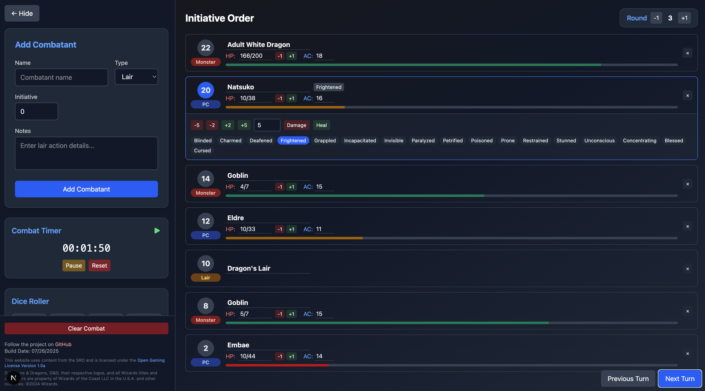

# D&D Combat Tracker

A modern, responsive combat tracker for D&D 5E and similar tabletop RPGs. Built with Next.js, React, and TailwindCSS.



## Features

### Combat Management

- **Initiative Tracking**: Automatically sorts combatants by initiative
- **Turn Management**: Easy next/previous turn navigation
- **Round Counter**: Track combat rounds with increment/decrement controls
- **Combat Timer**: Track how long combats take in real-time
- **State Persistence**: Combat state automatically saves between sessions

### Combatant Features

- **Multiple Types**: Support for PCs, NPCs, Monsters, and Lair Actions
- **Health Tracking**: Visual HP bars with dynamic color changes
- **Status Effects**: Track conditions like Stunned, Poisoned, etc.
- **Quick Remove**: Easily remove defeated combatants

### Utility Tools

- **Dice Roller**: Quick access to common dice (d4-d100)

## Getting Started

1. Clone the repository:

   ```bash
   git clone https://github.com/bhtylerbell/combat-tracker.git
   ```

2. Install dependencies:

   ```bash
   cd combat-tracker
   npm install
   ```

3. Run the development server:

   ```bash
   npm run dev
   ```

4. Open [http://localhost:3000](http://localhost:3000) in your browser

## Usage Guide

### Adding Combatants

1. Fill in the combatant details in the sidebar form
2. Set initiative, HP, and AC
3. Click "Add to Combat" to add them to the tracker
4. Combatants are automatically sorted by initiative

### Managing Combat

- Use "Next Turn" to advance to the next combatant
- Use "Previous Turn" to go back one turn
- Round automatically increments when returning to the first combatant
- Combat timer tracks total duration
- Use the dice roller for quick rolls

### Status Effects

1. Click the status effect button on a combatant card
2. Select from common conditions
3. Effects are visually displayed on the combatant card

### Persistence

- Combat state automatically saves to browser storage
- Reloading the page maintains:
  - Combatant list
  - Current turn
  - Round number
  - Combat timer

## Technology Stack

- **Framework**: Next.js 13+ with App Router
- **Language**: TypeScript
- **Styling**: TailwindCSS
- **State Management**: React Hooks
- **Storage**: Browser LocalStorage
- **Analytics**: Vercel Analytics

## Contributing

1. Fork the repository
2. Create a feature branch
3. Commit your changes
4. Push to the branch
5. Open a Pull Request

## License

This project is licensed under the MIT License - see the [LICENSE.md](LICENSE.md) file for details.

## Acknowledgments

- Built with [Next.js](https://nextjs.org/)
- Styled with [TailwindCSS](https://tailwindcss.com/)
- Deployed on [Vercel](https://vercel.com/)

## Support

For support, please open an issue in the GitHub repository or contact the maintainers.
